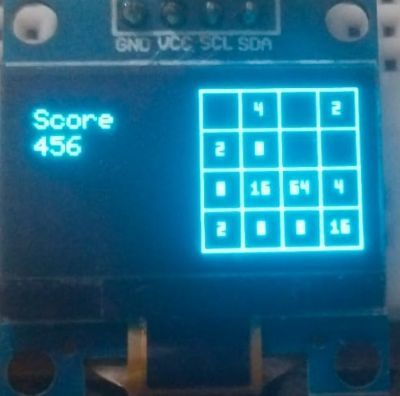

# ESP32 2048 Game on OLED

This project is a fully functional version of the classic **2048 game**, implemented on an **ESP32 microcontroller** with an **SSD1306 OLED display** and **push buttons** for input. The game challenges the player to combine tiles and reach the **2048 tile**—but the logic allows continuing all the way to **8192 and beyond**!

---

## Features

- Fully playable 2048 game on a 128×64 OLED screen
- 4-directional movement using push buttons
- Optimized tile display using small custom bitmap characters
- Continue playing even after reaching 2048

---

## 🛠 Hardware Used

| Component         | Details                          |
|------------------|----------------------------------|
| Microcontroller   | ESP32 DevKit v1                  |
| Display           | SSD1306 OLED (128x64, I²C)       |
| Input             | 4 Push Buttons (Up, Down, Left, Right) |
| Breadboard        | For prototyping                  |
| Jumper Wires      | For connections                  |

---

## Pin Configuration

### Button Pins
| Button   | ESP32 Pin |
|----------|------------|
| Left     | D13        |
| Right    | D12        |
| Up       | D14        |
| Down     | D27        |

### OLED Pins
| OLED Pin | ESP32 Pin |
|----------|------------|
| GND      | GND        |
| VCC      | 3.3V       |
| SCL      | D22        |
| SDA      | D21        |

---

## Libraries Used

- [Adafruit SSD1306](https://github.com/adafruit/Adafruit_SSD1306)
- [Adafruit GFX Library](https://github.com/adafruit/Adafruit-GFX-Library)

Install these via PlatformIO.

---

## Preview

> This image shows the current tile state on the OLED display. Numbers are displayed using custom bitmap fonts to save space.

---

## License

This project is licensed under the [MIT License](LICENSE).
